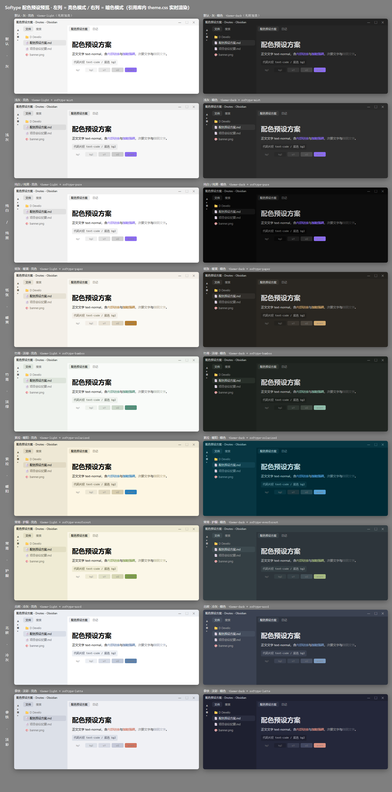

# Softype

[English](#english) · [简体中文](#简体中文)

---

## English

A soft, minimal Obsidian theme made for long writing sessions — pastel palettes, calm contrast, and a sidebar that stays visually separate from the note area.

*Nine color presets, rendered from this theme's own `theme.css` (light / dark).*

### What's in it

- **9 color presets**, switchable in one click with the [Style Settings](https://github.com/mgmeyers/obsidian-style-settings) plugin — no CSS editing
- **Light and dark** variants for every preset
- **Typing first**: restrained styling, comfortable measure, no decorative noise
- **A sidebar that reads as a separate surface** from the note area

| Preset | Character |
|---|---|
| 默认 · 灰 (default) | neutral grey, no extra CSS |
| 浅灰 (`softype-mist`) | soft grey |
| 纯白 / 纯黑 (`softype-pure`) | pure white / pure black |
| 纸张 · 暖黄 (`softype-paper`) | warm paper, amber accent |
| 竹青 · 淡绿 (`softype-bamboo`) | pale green, bamboo accent |
| 索拉 · 暖阳 (`softype-solarized`) | Solarized palette |
| 常青 · 护眼 (`softype-everforest`) | Everforest greens |
| 北欧 · 冷灰 (`softype-nord`) | Nord cool greys |
| 拿铁 · 淡彩 (`softype-latte`) | Catppuccin Latte |

### Install

**Manual:** copy this folder into `<vault>/.obsidian/themes/Softype/`, then **Settings → Appearance → Themes** → choose **Softype**.

**Presets (optional):** install the **Style Settings** plugin, then **Settings → Style Settings → Softype → 配色风格**.

### Requirements

- Obsidian `1.0.0` or later
- [Style Settings](https://github.com/mgmeyers/obsidian-style-settings) — only if you want to switch presets

### Known limits

- If you set a custom color in **Settings → Appearance → Accent color**, it overrides the preset's accent — Obsidian applies it inline on `body`.
- In dark mode, Solarized / Everforest / Nord keep a slightly lighter sidebar than the main area. That is how those palettes are designed, not a bug.

### License

[MIT](LICENSE) © 2026 luodanshibing

---

## 简体中文

一款为长文写作准备的 Obsidian 主题：**淡彩、极简**，配色柔和、对比克制，左侧栏与笔记区在视觉上分开。

*九套配色预设，用本主题自己的 `theme.css` 实时渲染（左亮右暗）。*

### 特性

- **9 套配色预设**，用 [Style Settings](https://github.com/mgmeyers/obsidian-style-settings) 插件一键切换，不用改 CSS
- **每套预设都有亮色与暗色**两版
- **先顾打字**：样式克制、行宽舒服、没有装饰性噪音
- **左侧栏与笔记区分色**，笔记区读起来像一页纸

### 九套预设

| 预设 | 说明 |
|---|---|
| 默认 · 灰 | 中性灰，不附加任何规则 |
| 浅灰（`softype-mist`） | 柔和浅灰 |
| 纯白 / 纯黑（`softype-pure`） | 纯白底 / 纯黑底 |
| 纸张 · 暖黄（`softype-paper`） | 暖纸色，琥珀强调色 |
| 竹青 · 淡绿（`softype-bamboo`） | 淡青绿，竹青强调色 |
| 索拉 · 暖阳（`softype-solarized`） | Solarized 配色 |
| 常青 · 护眼（`softype-everforest`） | Everforest 绿系 |
| 北欧 · 冷灰（`softype-nord`） | Nord 冷灰 |
| 拿铁 · 淡彩（`softype-latte`） | Catppuccin Latte |

### 安装

**手动安装**：把本仓库整个文件夹放到 `<库根目录>/.obsidian/themes/Softype/`，然后 **设置 → 外观 → 主题** 里选 **Softype**。

**切换配色预设**（可选）：先装 **Style Settings** 插件，再进 **设置 → Style Settings → Softype → 配色风格** 选择。

### 环境要求

- Obsidian `1.0.0` 或更高
- [Style Settings](https://github.com/mgmeyers/obsidian-style-settings) 插件 —— 只有想切换预设时才需要

### 已知边界

- 如果你在 **设置 → 外观 → 强调色** 里手动指定过颜色，它会盖住预设的强调色（Obsidian 把该颜色写在内联样式里，作用在 `body` 上）。
- 暗色模式下，索拉 / 常青 / 北欧这三套的**左侧栏比主区略亮** —— 那是原配色方案本来的面貌，不是写反了。

### 主题为什么叫 Softype

我的主题是"淡彩"和"极简"风格，在众多体现主题特色(淡彩、极简)的词汇(比如 minimal、Simplicity、Soft、Subtle、Muted、Pastel 等)中，我并没有找到令我舒适的组合。

我转念又想，我自定义主题的目的是为了"舒服的打字"，我自己的定义也是"专注于内容"，以内容输出为主，拒绝花哨的样式以及兼容性不好的格式。

所以我决定不再以主题风格命名，而是以主题目标命名，那就是"舒舒服服的打字"。

为此我精选了一些名字：

1. TypeMin —— Type 体现编辑、输入的核心功能，Min 代表极简（Minimal）
2. EditPure —— Edit 强调编辑功能，Pure 表示纯净、简洁
3. LiteEdit —— Lite 意味着轻量、简洁，Edit 突出编辑功能
4. PureType —— Pure 表示纯净、无多余装饰，Type 体现输入、打字的核心体验
5. MinEdit —— Min 极简，Edit 编辑
6. SoftType —— Soft 柔和，符合淡彩风格；Type 输入、打字
7. PaleEdit —— Pale 浅色、淡彩，Edit 编辑
8. MintEdit —— Mint 薄荷，给人一种清新、简洁的感觉
9. GentleType —— Gentle 柔和、温和，符合淡彩风格
10. CalmEdit —— Calm 平静、简洁
11. EaseType —— Ease 轻松、简单
12. MellowEdit —— Mellow 柔和、温暖
13. PureEdit —— Pure 纯净、简洁
14. SubtleType —— Subtle 微妙、不张扬，符合淡彩风格
15. TenderEdit —— Tender 柔和、细腻

最终我决定将自定义主题名称为 **Softype**，由"Soft"和"Type"组合而来。

> 这个命名参考了"Typora"的命名方式：Typora 这个名字可能来源于"Type"（打字、输入）和"Opera"（作品、创作）的组合，体现了这款编辑器专注于文本创作的特点。Typora 是一款轻量级的 Markdown 编辑器，注重简洁和高效，其设计理念是让用户能够专注于内容创作，而不被复杂的格式和界面干扰。

### 许可证

[MIT](LICENSE) © 2026 luodanshibing
